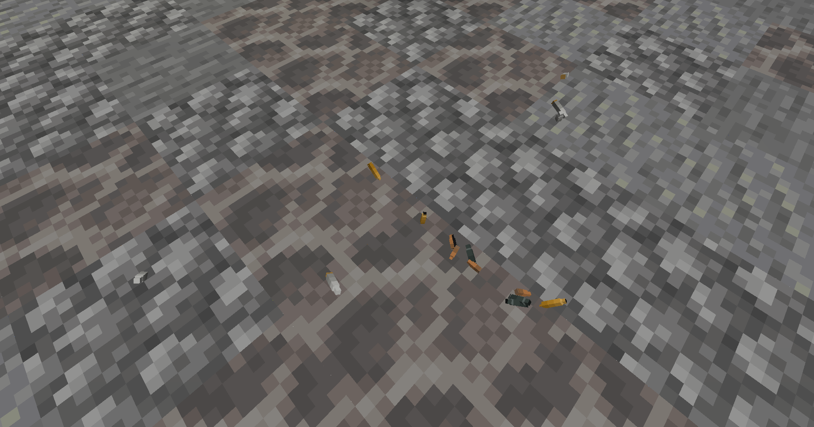
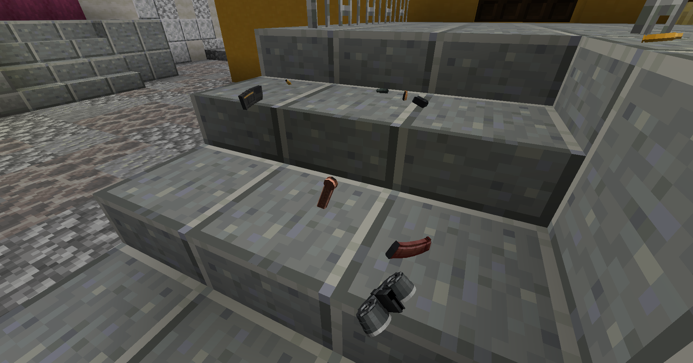

# MagazineAndCasing
An addon for TACZ (Timeless and Classics Zero: TaCZ) that adds two kinds of droppable physics entities — magazines and shell casings — to make shooting and reloading feel more realistic. 

**Client + server**, Minecraft 1.20.1 / Forge.

## Features
- **Empty-reload magazine drop**:magazine-fed guns eject a magazine entity when reloading from empty, with full physics — gravity, bouncing, friction, and spin.
- **Accurate magazine model**: the magazine bone is extracted directly from the gun model and rendered standalone, automatically adapting to extended magazines (extend_mag 1/2/3), with optional "model replacement" to swap one gun's magazine for another's.
- **Firing ejects shell casings**: a casing entity pops out to the player's right when firing, with initial velocity and spin modeled after the original shell config.
- **Correct manual-action ejection**: bolt/lever-action guns don't eject on fire — the casing is thrown only when re-chambering (working the bolt).
- **Reload casing drops**: shotguns, revolvers, and lever guns can eject a configured number of casings on reload (e.g. gunid|5).

